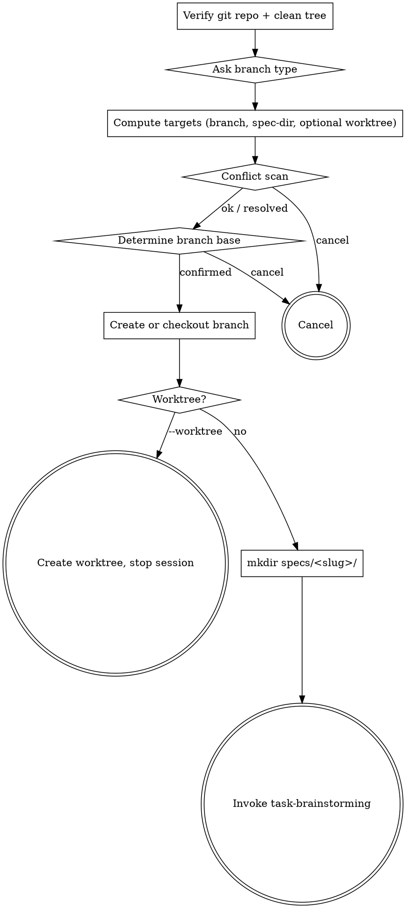

# p-flow Wave D — cleanup batch

> **For agentic workers:** REQUIRED SUB-SKILL: Use `superpowers:subagent-driven-development` or `superpowers:executing-plans`. Steps use checkbox (`- [ ]`) syntax.

**Goal:** Close the remaining medium/low-priority items from the parity audit's roll-up (see `parity.md` Tier 1+2 cleanup list). Pure polish + 2 new low-stakes skills + better contributor docs. No behavioural changes to existing skills.

**Spec reference:** `plugins/p-flow/docs/specs/2026-05-27-superpowers-parity.md` + master plan's Wave D table.

**Items dropped after pre-execution review (user decisions):**
- D-5 — Agent → Task tool terminology rename — skipped (cosmetic; both names work in CC, our existing files are already mixed).
- D-10 — `dispatching-parallel-agents` skill — deferred (YAGNI; review skills work sequentially; add when actually needed).

**Items narrowed:**
- D-6 — Graphviz adoption — scoped to `task-start` only (where Phase A/B branching benefits from a flow diagram), not retrofit to other skills.

**Final Wave D scope: 8 items.**

---

## File map

| # | File(s) | Action | Task |
|---|---|---|---|
| D-1 | `skills/task-end/SKILL.md` | modify (add `## Design note`) | 1 |
| D-2 | `skills/using-git-worktrees/SKILL.md` | create (reference skill) | 2 |
| D-3 | `skills/writing-skills/SKILL.md` | create (meta-skill, lean port) | 3 |
| D-4 | `skills/{task-brainstorming,writing-plan,verification-before-completion}/SKILL.md` | modify `allowed-tools` (drop unused) | 4 |
| D-6 | `skills/task-start/SKILL.md` | modify (add digraph diagram of Phase A/B) | 5 |
| D-7 | 10 SKILL.md files (all except `using-p-flow` which is auto-emitted) | modify (prepend "Announce at start" line) | 6 |
| D-8 | `plugins/p-flow/RELEASE-NOTES.md` | create | 7 |
| D-9 | `plugins/p-flow/CLAUDE.md` | create (contributor doc) | 8 |
| — | `using-p-flow/SKILL.md` + `plugins/p-flow/README.md` | modify (mention new skills + RELEASE-NOTES + CLAUDE.md) | 9 |
| — | `plugin.json` + `marketplace.json` + tag | bump + release | 10 |

---

## Task 1 — D-1: task-end "Design note"

**Goal:** Explicitly document WHY task-end stays narrow (push + recommend-MR), no merge/PR/cleanup menu — per user decision Q3 in parity spec. Defends against drift.

- [ ] **Step 1:** Add `## Design note` block at the top of `skills/task-end/SKILL.md` body, before `## Pre-checks`:

```markdown
## Design note

task-end deliberately offers no options menu (no "merge/PR/cleanup" branching, unlike `superpowers:finishing-a-development-branch`). The skill does push + MR-recommend, then stops. Rationale: `git merge` / `gh pr merge` / branch cleanup are user-driven decisions made outside the AI-loop; offering a menu inside the skill conflates "what to recommend" (our job) with "what to do next" (the user's call). If you find yourself wanting a menu here, that's a signal to use the host's web UI or `gh`/`glab` CLI directly — both produce a clearer audit trail than a chat-driven decision.
```

- [ ] **Step 2:** Commit `git add plugins/p-flow/skills/task-end/SKILL.md && git commit -m "docs(p-flow): task-end design note — why no merge/PR/cleanup menu"`

---

## Task 2 — D-2: `using-git-worktrees` reference skill

**Goal:** Standalone skill documenting how to create/use git worktrees safely. Reusable by any future skill that needs worktree management. task-start's existing `--worktree` flag stays as-is (this skill is reference, not refactor).

- [ ] **Step 1:** Create `plugins/p-flow/skills/using-git-worktrees/SKILL.md`. Lean adaptation, ~80 lines:

```markdown
---
name: using-git-worktrees
description: Use when starting work that benefits from isolation from the current checkout (parallel feature branches, long-running experiments, freeing the main checkout for unrelated work). Documents safe worktree creation, common pitfalls, and cleanup.
allowed-tools: Bash(git worktree:*) Bash(git rev-parse:*) Bash(git branch:*) Bash(test:*) Read
---

# using-git-worktrees

A worktree is a second checkout of the same repository at a different filesystem path. Useful when you want isolation (different branch + different files on disk) without losing your current checkout's state.

## When to use

- Long-running feature work where you also need to fix urgent bugs in the main checkout.
- Experiments you want to abandon cleanly (delete the worktree, no merge conflicts elsewhere).
- Parallel reviews — one worktree per branch under review.

**Don't use when:**
- The branch you'd create the worktree for already has its checkout active somewhere — `git worktree add` will refuse.
- Disk space is tight — each worktree is a full file tree, not just a delta.

## Procedure

### Creating a worktree

1. Pick a path *outside* the current repo's directory tree. Convention: sibling dir named `<repo>-<branch-slug>` (e.g. `myrepo-feature-foo` next to `myrepo/`).
2. Run: `git worktree add <path> <branch>` — creates the path AND checks out `<branch>` there. If the branch doesn't exist yet: `git worktree add -b <new-branch> <path> <base-ref>`.
3. Open a new terminal / Claude Code session targeting `<path>`. The original checkout stays where it was on its original branch.

### Common pitfalls

- **Windows path length (260 chars).** Long worktree paths can hit Windows' `MAX_PATH` limit. Mitigation: `git config --global core.longpaths true` and use short branch slugs.
- **CWD doesn't follow.** A worktree is a different filesystem location. Your current session's CWD stays where it was; `cd` into the worktree (or open a new session) to actually work there.
- **Don't delete worktree dirs with `rm -rf`.** Use `git worktree remove <path>` so git's worktree registry stays consistent. Force-delete (`rm -rf`) leaves stale entries that `git worktree list` shows; `git worktree prune` cleans them up.
- **Submodules.** `git worktree add` doesn't auto-init submodules in the new tree. Run `git submodule update --init --recursive` in the new worktree if needed.

### Cleanup

- Done with the branch? `git worktree remove <path>` (refuses if the worktree has uncommitted changes; use `--force` consciously).
- Branch merged? You can delete the branch from any checkout: `git branch -d <branch>`. The worktree's HEAD points at the now-deleted branch — remove the worktree first.

## Hard rules

- **Never `git worktree add` onto a path that already exists** — git refuses, but the error is opaque. Check `test -e <path>` first.
- **Never share a worktree's branch with another worktree.** Two worktrees on the same branch is forbidden; git refuses.
- **Never commit hooks that assume the working tree is the only one.** Hooks run in whichever worktree triggers them; they shouldn't reach across.

## What this skill does NOT do

- Does not create worktrees for you — you (or the calling skill) run `git worktree add`.
- Does not manage worktree-specific config (per-worktree gitconfig, sparse-checkout, etc.) — out of scope; consult `git-worktree(1)`.
- Does not handle `git-svn` or non-git VCS worktree equivalents.
```

- [ ] **Step 2:** Test + commit.

```bash
npm test -- tests/skills.test.ts 2>&1 | tail -2
git add plugins/p-flow/skills/using-git-worktrees/SKILL.md
git commit -m "feat(p-flow): add using-git-worktrees reference skill"
```

---

## Task 3 — D-3: `writing-skills` meta-skill

**Goal:** Document how to create new p-flow skills consistently. Port superpowers' `writing-skills` adapted to p-flow voice.

- [ ] **Step 1:** Create `plugins/p-flow/skills/writing-skills/SKILL.md`, ~120 lines:

```markdown
---
name: writing-skills
description: Use when creating a new skill or substantially editing an existing one — establishes the p-flow skill conventions (frontmatter shape, section order, dispatch patterns, template placement, test coverage) so the plugin stays internally consistent.
allowed-tools: Read Write Edit Glob
---

# writing-skills

A skill in p-flow is a Markdown file at `skills/<name>/SKILL.md` with YAML frontmatter + body. This skill documents what makes a good p-flow skill.

## When to use

- Creating a new skill (new directory under `skills/`).
- Substantially editing an existing SKILL.md (more than typo-level changes).
- Reviewing a PR that adds or edits a skill.

## Frontmatter conventions

Every p-flow SKILL.md MUST have:

```yaml
---
name: <dir-name>                    # MUST match the directory name
description: <one-line, ≥ 30 chars> # "Use when ..." or "Use after ..." — what triggers the skill
allowed-tools: <space-separated>    # Tightest allowlist that covers the body's actual usage
---
```

May have:
- `argument-hint: <pattern>` — if the skill is a user-facing slash command (`/p-flow:<name>`).

Do NOT use:
- `tools:` (that's the agents/ field; p-flow uses inline templates, not registered agents).
- `model:` (skills don't pick models; the calling subagent does).
- `color:` (UI affordance for agents only).

## Body section conventions

p-flow's voice is **procedural**, not pedagogical. Sections in order:

1. `# <name>` — one-sentence what-this-does
2. `## When to use` — triggers, plus "Don't use when" exclusions
3. `## Inputs` (if any) — what the skill expects in context
4. `## Procedure` — numbered steps
5. `## Hard rules` — non-negotiables
6. `## Red flags — STOP` — rationalizations to refuse
7. `## What this skill does NOT do` — out-of-scope clarification

Optional sections: `## Output format` (for skills that emit structured artifacts), `## Design note` (when a deliberate divergence needs defending against drift).

## Dispatch patterns

- **Skill invokes another skill** → use the `Skill` tool.
- **Skill dispatches a reviewer** → use the `Task` tool with `subagent_type: general-purpose` + inline a template file colocated with the SKILL.md (`${CLAUDE_SKILL_DIR}/<reviewer>.md`). Do NOT use registered subagents — p-flow migrated away from that pattern in Wave A (see `docs/plans/2026-05-27-superpowers-parity-remediation.md`).

## Templates

- **User-repo templates** (init copies into `.claude/templates/p-flow/`) → live in `_shared/templates/` with `*.template.<ext>` naming. init must reference them.
- **Skill-internal templates** (read at runtime, never copied) → live in `_shared/templates/` too; the consuming skill references via `${CLAUDE_SKILL_DIR}/../_shared/templates/<file>`.
- Every template in `_shared/templates/` MUST be referenced by at least one SKILL.md (dead-template test enforces this).

## Test coverage

Adding a new skill auto-triggers structural assertions:
- `tests/skills.test.ts` — frontmatter + body shape
- `tests/plugin-readme-coverage.test.ts` — the new skill must be mentioned in `plugins/p-flow/README.md` (backticks or slash-command form)

If the skill adds a new cross-skill invariant (e.g. references a canonical section name, dispatches a specific subagent, writes to a specific path), add an explicit assertion in `tests/p-flow-cross-skill-consistency.test.ts` or a new dedicated test file.

## Hard rules

- **One skill, one purpose.** If you find yourself writing two distinct procedures, split into two skills.
- **No code in skill bodies.** Skills are prompts, not implementations. Code goes in `tools/` (we don't ship any p-flow tools yet; first one would be a new pattern).
- **Procedural voice, not pedagogical.** No "Red Flags — STOP and Start Over" sections; use `## Red flags — STOP` with concrete forbidden phrases instead.
- **No XML emphasis tags** (`<EXTREMELY-IMPORTANT>`, `<SUBAGENT-STOP>`) except in `using-p-flow` (the discovery skill loaded by the SessionStart hook).

## Red flags — STOP

- "This is a one-off; doesn't need to follow conventions." If it lives in `skills/`, it follows the conventions. Otherwise put it in `docs/`.
- "I'll add tests later." No — adding a skill ships test infrastructure with it (auto-coverage). Adding cross-skill invariants without an explicit test is drift waiting to happen.
- "The frontmatter description doesn't fit on one line." Then the skill is doing too much; split it.

## What this skill does NOT do

- Does not generate skills automatically — you write the SKILL.md by hand.
- Does not validate the skill's behavioural effectiveness — that's manual smoke testing (see `parity.md` "Tier 3 — not testable automatically").
- Does not enforce style on existing skills retroactively — only applies when you're authoring or editing.
```

- [ ] **Step 2:** Test + commit.

---

## Task 4 — D-4: `allowed-tools` cleanup

**Goal:** Tighten 3 skills' `allowed-tools` to only what the body actually uses. From parity audit Dim C-2.

- [ ] **Step 1:** Inspect each:

```bash
for skill in task-brainstorming writing-plan verification-before-completion; do
  echo "=== $skill ==="
  grep "^allowed-tools:" plugins/p-flow/skills/$skill/SKILL.md
  echo "body mentions:"
  for t in Bash Read Write Edit Glob Grep Skill Task Agent; do
    body=$(sed -n '/^---$/,/^---$/!p' plugins/p-flow/skills/$skill/SKILL.md)
    if echo "$body" | grep -q "$t"; then echo "  $t"; fi
  done
done
```

- [ ] **Step 2:** For each skill, drop unused tools from `allowed-tools`. Specifically:
  - `task-brainstorming` — currently has `Edit` declared but body never edits (only writes new files). Drop `Edit`.
  - `writing-plan` — currently has `Edit Glob` declared; body only reads + writes. Drop `Edit Glob` (keep `Read Write`).
  - `verification-before-completion` — currently has `Read Glob Grep Edit` declared in addition to `Bash Write`. Body uses Bash (runs tests) + Write (marker + gitignore). Drop `Read Glob Grep Edit`.

  Caveat: if a skill might Read a config file during its procedure (even if not explicit in the body), keep `Read`. For these 3, no Read needed except potentially `task-brainstorming` reading spec templates — actually it DOES read templates per `Inputs` section. So keep `Read` for task-brainstorming.

- [ ] **Step 3:** Validate + commit.

---

## Task 5 — D-6: Graphviz in `task-start`

**Goal:** Add a `digraph` flow diagram visualizing Phase A → Phase B branching. Just task-start (per user decision).

- [ ] **Step 1:** Insert a `digraph` block at the top of `## Phase A` section in `skills/task-start/SKILL.md`:

```markdown

```

- [ ] **Step 2:** Commit.

---

## Task 6 — D-7: "Announce at start" convention

**Goal:** Add an `**Announce at start:**` line at the top of every skill body (except using-p-flow which is auto-emitted, not invoked). 10 files.

- [ ] **Step 1:** For each of: `init`, `task-brainstorming`, `writing-plan`, `verification-before-completion`, `requesting-code-review`, `requesting-task-review`, `task-start`, `task-end`, `test-driven-development`, `receiving-code-review`:

  Insert after the `# <name>` heading and before the next section:

  ```markdown
  **Announce at start:** *"I'm using the `<name>` skill to <one-line purpose>."*
  ```

  Adapt the purpose phrase per skill.

- [ ] **Step 2:** Validate + commit.

---

## Task 7 — D-8: `plugins/p-flow/RELEASE-NOTES.md`

**Goal:** Backfill release notes from v4.6.0 through v4.9.0.

- [ ] **Step 1:** Create the file with sections per release (descending order):

```markdown
# p-flow Release Notes

## v4.9.0 — 2026-05-27 — Wave C (TDD + receiving-code-review)
...
## v4.8.0 — 2026-05-27 — Wave B (discovery skill + SessionStart hook)
...
[and so on through v4.6.0]
```

Pull from `git log` for accurate dates + commit subjects.

- [ ] **Step 2:** Commit.

---

## Task 8 — D-9: `plugins/p-flow/CLAUDE.md`

**Goal:** Contributor guide for p-flow plugin specifically. Captures the decisions we made today so future contributors don't re-litigate.

- [ ] **Step 1:** Create with sections:

```markdown
# p-flow — contributor guide

## Architecture decisions

- **Reviewers as inline templates, not registered subagents** — Wave A (2026-05-27). See `docs/plans/2026-05-27-superpowers-parity-remediation.md`.
- **Discovery via SessionStart hook + `using-p-flow` skill** — Wave B.
- **Two plan template variants (TDD-aligned + generic)** — Wave C.
- **task-end stays narrow (no merge/PR menu)** — see `skills/task-end/SKILL.md` "Design note".

## Conventions
[refer to writing-skills SKILL.md for skill authoring]

## Severity model
[blockers / suggestions / nits — used by both review templates]

## Plan.md canonical sections
[Steps / Review follow-ups / Review decisions (audit) / Open questions / Risks]

## Test invariants
[which tests enforce what]
```

- [ ] **Step 2:** Commit.

---

## Task 9 — Update using-p-flow + plugin README

- [ ] Add `using-git-worktrees` and `writing-skills` to the Skills tables in both `skills/using-p-flow/SKILL.md` and `plugins/p-flow/README.md`.
- [ ] Add a paragraph in plugin README pointing at `RELEASE-NOTES.md` + `CLAUDE.md` (contributor doc).
- [ ] Commit.

---

## Task 10 — Release

- [ ] **Step 1:** Validate + tests.
- [ ] **Step 2:** Bump p-flow `0.5.0` → `0.6.0` (minor — adds 2 skills + meta docs).
- [ ] **Step 3:** Marketplace tag: `v4.9.0` → `v4.10.0` (minor).
- [ ] **Step 4:** Propose to user with version + reasoning. Wait for confirmation.
- [ ] **Step 5:** Push + tag.

---

## Self-review checklist

- [ ] task-end has `## Design note` documenting stay-narrow rationale.
- [ ] using-git-worktrees + writing-skills exist with valid frontmatter; both pass skills.test.ts.
- [ ] 3 skills' `allowed-tools` no longer declare unused tools.
- [ ] task-start contains a digraph block in Phase A.
- [ ] 10 skill bodies have `**Announce at start:**` line.
- [ ] `plugins/p-flow/RELEASE-NOTES.md` exists with entries v4.6.0 → v4.9.0.
- [ ] `plugins/p-flow/CLAUDE.md` exists with architecture decisions + conventions.
- [ ] using-p-flow + plugin README mention the 2 new skills.
- [ ] Tests green; `v4.10.0` tag created after explicit user confirmation.

## What this Wave deliberately does NOT do

- D-5 (Agent → Task rename) — skipped per user decision (cosmetic, both names work).
- D-6 (Graphviz everywhere) — narrowed to task-start only.
- D-10 (dispatching-parallel-agents skill) — deferred until actually needed.
