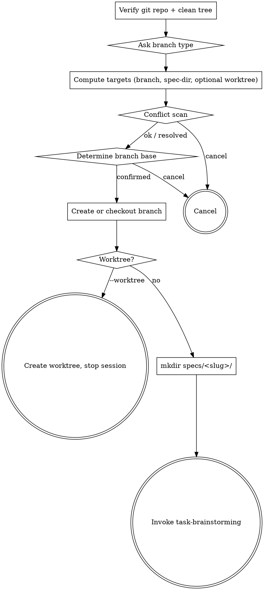

# /p-flow:task-start

Open a new task in the p-flow flow. Always read-only checks first, then atomic state changes.

**Announce at start:** *"I'm using the `task-start` skill to open a new task — branch, spec dir, brainstorming."*

## Arguments

- `<slug>` — kebab-case, lowercase, ≤ 50 chars. Required. If missing — ask the user.
- `--worktree` — optional flag. If present, the new branch is checked out in a fresh git worktree at `<repo-parent>/<repo-dir>-<slug>` instead of switching the current checkout.

## Flow

## Phase A — read-only resolution (no side effects)

1. **Verify git repo.** Run `git rev-parse --show-toplevel`. If it fails — stop and tell the user: *"Not a git repo. Run `git init` first."*

2. **Verify clean working tree.** Run `git status --porcelain`. If output is non-empty — stop. Tell the user: *"Working tree is dirty. Commit or stash before starting a new task."*

3. **Ask for branch type.** Prompt the user with 5 options: `feature` / `bugfix` / `hotfix` / `chore` / `docs`. If a strong hint from prior conversation exists (e.g. the user said "fix a bug"), pre-select it but allow override.

4. **Compute targets:**
   - `<branch>` = `<type>/<slug>`
   - `<spec-dir>` = `specs/<slug>/`
   - `<worktree-path>` (only if `--worktree`) = the absolute path of the repo's parent directory, joined with `<basename-of-repo>-<slug>`. Use `git rev-parse --show-toplevel` to get the repo dir, then derive parent.

5. **Conflict scan (collect all, then resolve before mutating):**
   - Does `<branch>` already exist? `git branch --list <branch>` non-empty?
   - Does `<spec-dir>` exist and is non-empty? `test -d <spec-dir> && test -n "$(ls <spec-dir>)"`
   - If `--worktree`: does `<worktree-path>` already exist? `test -e <worktree-path>`
   - If `<worktree-path>` exceeds 200 chars on Windows — warn and recommend `git config --global core.longpaths true`.

   For any conflict — ask the user with a clear menu:

   - Branch exists → check out existing / pick different slug / cancel.
   - Spec dir exists and non-empty → continue editing existing / pick different slug / cancel.
   - Worktree path exists → pick different slug / cancel.

6. **Determine branch base:**
   - If on `main` or `master` — branch from there.
   - Otherwise — ask: branch from current HEAD / branch from `main` / cancel.

## Phase B — atomic side effects

Only after Phase A completes without `cancel`:

7. **Create or check out the branch.** Two cases:

   - **User chose "check out existing"** in Phase A → run **only** `git switch <branch>`. Do NOT run `git branch` — the branch already exists, and `git branch <branch>` would fail with `fatal: A branch named '<branch>' already exists`.
   - **Otherwise** (new branch) → run `git branch <branch> <base-ref>` to create it. Then run `git switch <branch>` — UNLESS `--worktree` is in play, in which case skip `switch` (the worktree will check out the branch elsewhere in step 8).

8. **(if `--worktree`) Create the worktree and hand off.** Run `git worktree add <worktree-path> <branch>`, then print:

   *"Worktree created at `<worktree-path>`. Open a new Claude Code session in that directory and run `/p-flow:task-start <slug>` (without `--worktree`) again — or just `task-brainstorming` directly — to continue. This session stays in the original checkout."*

   **Stop here.** Do NOT proceed to steps 9–10 in this session — they would write `specs/<slug>/` and invoke brainstorming in the *original* checkout, defeating worktree isolation. The new session in the worktree picks up from step 9.

9. **Ensure `specs/<slug>/` exists.** `mkdir -p specs/<slug>/`. If the user chose "continue editing existing" — leave its contents alone.

10. **Invoke `task-brainstorming` via the Skill tool.** Pass `<slug>` and `<type>` as initial context. Do not chain implicitly to any other skill — `task-brainstorming` itself decides when to invoke `writing-plan`.

## What this skill does NOT do

- Does not write any spec content (that's `task-brainstorming`).
- Does not push.
- Does not modify `main`/`master`.
- Does not delete branches or worktrees on conflict — only refuses, gives user options.
